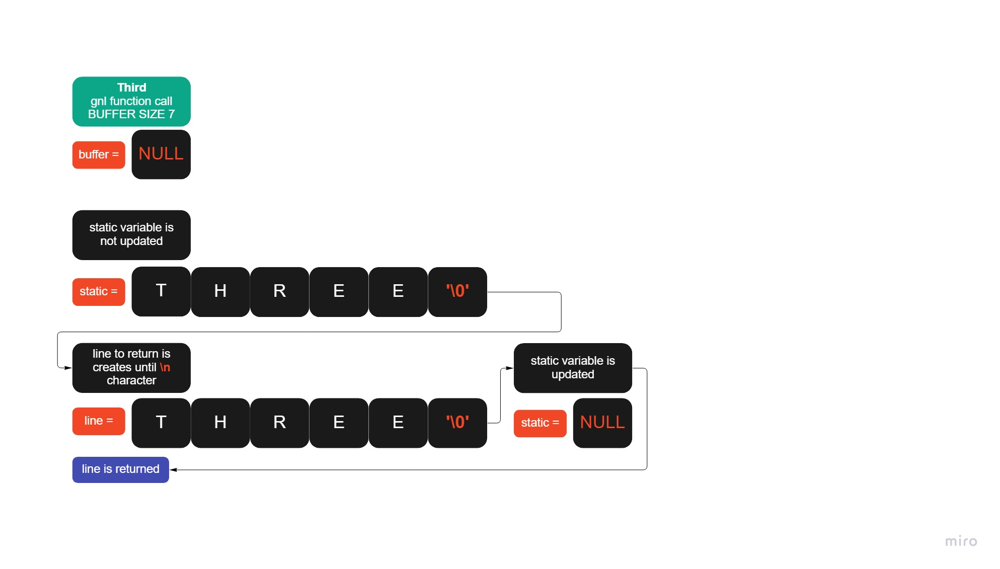

<h1 align="center"> Get next line </h1>

<p align="center"> A 42 project written in C language</p>

<p align="center">
  
  
</p>

---

## Introduction

<p> This project had the purpose of create a function that returns a line with '\n' character in the end if there any. Works with one or multiples file descriptors and stdin. </p>

- [Explanation](#Explanation)
- [Example 1](#example-1-logic-function)
- [Example 2](#example-2-call-function)
- [Usage](#%EF%B8%8F-usage)

### Explanation
The function works with fd's and stdin. Static variable and the read() function are used.
In the images bellow, you'll see examples of logic function and call function.

---

## Example 1 (logic function)

*_Consult the [code](get_next_line.c) for better undesrtanding_

---

## Example 2 (call function)




*_Consult the [code](get_next_line.c) for better undesrtanding_

## 🛠️ Usage
<p> For use this function, follow these steps:</p>

- Clone this repository:
```
https://github.com/willianportilho/get_next_line.git
```

- Include these headers on you code:  
``` c
#include "./get_next_line.h"
#include "./get_next_line_bonus.h"
```
_*If necessary, change the location. Remember that the include location depends on where your another files are._  


- Finally, compile the program whith this line:  
```
gcc your_program_here.c get_next_line.c get_next_line_utils.c get_next_line_bonus.c get_next_line_utils_bonus.c
```
